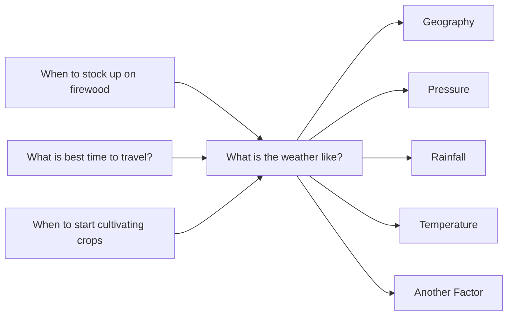
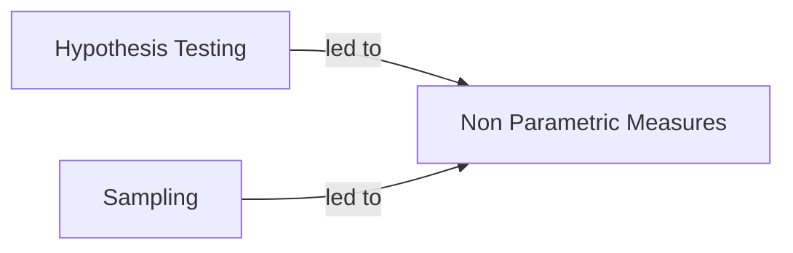

##NOTES

##Visual Timeline of Evolution of Data Science

![[Pasted image 20231122093040.png]]
##The definition of Data Science (7 Sectors)
![[Pasted image 20231122093930.png]] ^ac83f3

>[!info] 1	Beyond the Numbers	

## Origin of decisions
Prior to 1940 envision a person making decisions: video 2:30

*These 2 things are needed to address the above challenge. 
* Ability to deal with numbers* 
* Ability to process numbers *

>[!info] Paradigms of Data Science

Inference means: I'm seeing some numbers, what does it imply? what does ti say about something else?    
Computation means- we are calculating something, computing data. 

| Inferential                                                                                                  | Computational                                                                  | Category     |
| ------------------------------------------------------------------------------------------------------------ | ------------------------------------------------------------------------------ | ------------ |
| Make Predictions on population based on sample data                                                           | Leverage computational methods and technology to scale insight generation      | Focus        |
| Use Statistical methods to draw conclusions/inferences from data                                              | Implement algorithms and computational methods to analyse data                 | Methods      |
| Representativeness of data                                                                                   | Complexity of algorithms and cost of training large models                     | Limitations  |
| 1. Effectiveness of a new medication through randomized trial 2. Impact of a new policy on citizens        | 1. Weather forecasting based on historical and weather patterns. 2. Optimize routing of vehicles to minimize costs                | Examples     |

## Evolution of Data Science from early 1940s till 2020s and beyond

***A combo of two threads- inferential and computational

==Inferential==
[Central Tendency](https://en.wikipedia.org/wiki/Central_tendency)
			>
							imagine you and your friends are talking about the video games you like to play. Some of you play for just a few minutes each day, some for hours, and some in between. Central tendency is a way to find out what the "typical" amount of time is that most of you play.
							There are three main ways to figure this out:
									1. **Mean (or Average)**: This is like adding up all the minutes everyone plays and then sharing them equally. So, if you and two friends play for 30, 60, and 90 minutes, you add these up (30 + 60 + 90 = 180 minutes) and then divide by 3 because there are 3 of you. So, the average playtime is 60 minutes.
							    	2. **Median**: This is the middle number. First, you line up all the numbers in order. If you have an odd number of friends, the median is the number in the middle. If it's an even number of friends, you take the two middle numbers and find their average.
									3. **Mode**: This is the number that shows up the most. If most of your friends play for, say, 45 minutes, then 45 is the mode.
										Each of these ways gives you an idea of what's typical or normal among your group, ==and that's what central tendency is all about - finding out what's common or usual.==
[Expected Values](https://en.wikipedia.org/wiki/Expected_value) 
		$$
	E[X] = \sum_{i=1}^{n} p_i \cdot x_i
	$$
								Imagine you have a bag with some marbles in it. Some marbles are blue, and some are red. If you pick a blue marble, you get 2 dollars, but if you pick a red marble, you don't get any money. Expected value helps you figure out how much money you might get on average every time you pick a marble.
							    Let's say there are 4 blue marbles and 6 red marbles in the bag. Since there are more red marbles, you're more likely to pick a red one, right? But we still want to know, on average, how much money you might get each time you try.
								Here's how we do it:
								- First, we look at the chance of picking a blue marble. There are 4 blue marbles out of 10 total (4 blue + 6 red), so the chance is 4 out of 10, or 40%.
								- Each time you pick a blue marble, you get 2 dollars. So, the "value" of picking a blue marble is 40% of 2 dollars.
							- We do the same for the red marbles. But since you get 0 dollars for a red marble, it doesn't add any money to your expected value.
								Now, we add up the value from the blue and the red marbles, and that gives us the expected value. It tells us how much money, on average, you might get every time you reach into the bag and pick a marble. So, even though sometimes you might get 2 dollars and sometimes nothing, ==expected value gives you a kind of average "winning" over many, many picks.==
[Probability Theory](https://en.wikipedia.org/wiki/Probability_theory)
	Think of probability theory like a set of rules for a guessing game. This game helps you guess the chance of something happening, like flipping a coin and getting heads or tails.
	Imagine you have a bag full of different colored balls - some are red, some are blue, and some are yellow. If you close your eyes and pick a ball, probability theory helps you guess which color you might get. If most of the balls are blue, you're more likely to pick a blue one, right? Probability theory just puts numbers to these kinds of guesses.
	So, if you have 5 blue balls, 3 red balls, and 2 yellow balls, you have a total of 10 balls. The chance, or probability, of picking a blue ball is 5 out of 10 because there are 5 blue balls and 10 balls in total. In probability, we would say this chance is 50% because 5 is half of 10.
	Probability theory can be used for all kinds of things, like predicting the weather ("What's the chance it will rain tomorrow?"), in sports ("What's the chance my team will win?"), or even in video games ("What's the chance I'll find a rare item?"). It's like a mathematical way of making smart guesses!\\
			Industrial  Statistics
			Use of Prior knowledge to predict future uncertainties
					* [Control Chart Theory* ](https://en.wikipedia.org/wiki/Control_chart)- Dr Shewhart @ Bell Labs
					* Telephone manufacturing - Quality Control Process
					* Led to economic benefits - High quality with efficiency
					* lower wastage- Higher product quality\\
			Sampling Theory
			Make inference about a population using a sample
					*[ Frederick Taylor *Father of Scientific Management](https://en.wikipedia.org/wiki/Scientific_management)
					* Manpower Productivity assessments
					* To Improve manufacturing processes + Efficiency
					* Now - Advertising by Google/Meta- Target audience					
			[ANOVA](https://en.wikipedia.org/wiki/Analysis_of_variance)
			Compare the means of 3  + groups -Evidence the differences
						* [Ronald A Fisher- Statitiscan & Geneticist]( https://en.wikipedia.org/wiki/Ronald_Fisher)
						* Analyze experiments in Agriculture
						* Effect of different fertilizers>> Differences in yields
						* Now Market research, finance, quality control 
1.3 1940s----------------------------1950---------------------------------------------
				Digital Computers
					* Electronic device which can do math and logical calculations*
						* Electronic Numerical Integrator & Computer [(ENIAC)*](https://en.wikipedia.org/wiki/ENIAC)
						* Developed in US WW2- Artillery firing tables
						* finding trajectories for different types of guns
						* type of ammo+ external conditions (temp, wind)
				[Monte Carlo Methods](https://en.wikipedia.org/wiki/Monte_Carlo_method)
						>[info]Imagine you want to guess how many jellybeans are in a big jar. It's really hard to count them all one by one, right? The Monte Carlo method is like a clever way to make a good guess without counting every single jellybean. Here's how it works: Instead of counting all the jellybeans, you might take a smaller jar, count how many jellybeans fit in there, and then use that to guess how many are in the big jar. You're using a smaller, easier problem to help solve a bigger, harder one!
					* Run simulations with random inputs to arrive at conclusions*
						* Origin- Monte Carlo Casino- Chanced Based games
						* Develop during the Manhattan Project 1940s
						* Simulate the behavior of neutrons in a nuclear reactor 
						* Now- Predict weather patterns, financial markets
				Programming Languages
					*To have a computer understand instructions and execute them
						*[Fortan ](https://en.wikipedia.org/wiki/Fortran)-  the 1st programming language created*
						* Made for scientific and engineering calcs*
						* Revolutionizing Comm & learning

	Telegraph
	Difference Engine
	Audio Tapes
==Computational==

1.4 1960s------------------1970s------------------------------------------------------

 
 ==Inferential== 
[Non-Parametric Methods](https://corporatefinanceinstitute.com/resources/data-science/nonparametric-method/?campaignid=17756089871&adgroupid=&adid=&gad_source=2&gclid=Cj0KCQiApOyqBhDlARIsAGfnyMpMuPPicOSI3Ghsk2JVm-GsK9u5VFCa8pG6qHYGDbVM5UnFk_3uNfcaAt0kEALw_wcB) :
	In the world of math and computers, using a non-parametric method means the computer looks at the data it has and makes decisions based on patterns it sees, without relying on a strict formula. It's like making a collage with data, where the computer decides how to put everything together in a way that makes sense, even if it doesn't follow a specific recipe or pattern.*
Rely on ranking/ordering of data rather than distribution*
	[ ] **[Frank Wilcoxon- Wilcoxon](https://en.wikipedia.org/wiki/Frank_Wilcoxon) Rank-sum test*
	[ ] Effect of store ambiance on customer behavior
	[ ]Sales difference b/w 2 groups in 2 different stores
	[ ]More effective marketing and pricing strategies 
Decision Theory
		Imagine you're playing a board game where you have to make choices, like whether to take a shortcut that might be risky or a longer path that's safer. Decision theory is like the rules or tips to help you make the best choice. It's like having a smart guidebook that helps you think about what might happen for each choice you make.
Assign probabilities to different outcomes to make a decision
	[ ] Howard Raiffa -Economist-Negotiation Process
	[ ] Gov Agencies- achieve favorable outcomes
	[ ] ID optimal strategies using decision trees 
	[ ] Improved negotiation-labor, international trade
Robust Statistics
	Provide accurate results despite outliers/extreme values 
	[ ]  [John W. Tukey ](https://en.wikipedia.org/wiki/John_Tukey)- Statistician- Contributed to EDA
	[ ] Improve QQ process identify and remove outliers
	[ ] Box Plots- identify outliers and variations
	[ ] Manufacturing better products, lesser defects
==Inferential== 
1960s------------------1970s--------------------------------------------------------
==computational==
Operating Systems
	a software that manages resources and apps in a computer 
		[ ] GM are responsible for creating the 1st OS
		[ ] GM-NAA i/o designed for the IBM 704 mainframe
		[ ] To manage hardware and use them efficiently
		[ ] Today-Windows, MAC, Android, and Linux are everywhere
Database & Storage
	Store, organize & Query large amounts of data quickly 
		[ ]  [ChaRLES BACHMAN ](https://en.wikipedia.org/wiki/Charles_Bachman)- IBM - 1st DBMS ever created
		[ ] Business wanted database to be standardized 
		[ ]Common Business Oriented Language- COBOL
		[ ] Laid the roots for the creation of MySQL in 1995
Time Sharing Systems
	Many users can access a computer at same time
		[ ] Compatible Time Sharing System [CtSS](https://en.wikipedia.org/wiki/Compatible_Time-Sharing_System)
		[ ] Created by MIT to access one IBM computer
		[ ] The seed thought for the modern networking systems
		[ ] Today's cloud exists because of the experiment 
		
 ==computational==

1.5 1980s------------------1990s------------------------------------------------------

==Inferential== 
Resampling Method. *>> today many inferential techniques rely on computational  capabilities* 
	Simulation multiple datasets from original data for analysis
		[ ]  Brad Efron- [Bootstrap technique  ](https://en.wikipedia.org/wiki/Bootstrapping_(statistics))
		[ ]  Market Research Survey-Calculate the uncertainty of data 
		[ ]  Estimate sampling distribution + hypothesis testing
		[ ]  More accurate estimates + better decision making
Generalized Linear Models
	Analyze data where outcome is not normally distributed
		[ ]  John Nelder + Rob  Wedderburn
		[ ]  Insurance claim modeling- ID risk exposure
		[ ]  Model different types of response variables
		[ ]  More accurate + flexible modeling for several data types 
Model section Techniques
	Select best mathematical model for process
		[ ]  Akaike- [Akaike info Criterion (AIC)](https://en.wikipedia.org/wiki/Akaike_information_criterion)
		[ ]  Demand forecasting-Accurate Predictions
		[ ]  AIC Evaluate model- Fit, explainability, accuracy
		[ ]  Better model selection improved prediction accuracy

1980s------------------1990s------------------------------------------------------

==computational==
Personal Computers
	Small, lightweight, affordable - used by a single person
		[ ]  [Altair 8880 1st PC 1975 ](https://en.wikipedia.org/wiki/Altair_8800)- company called MITS
		[ ]  This was a primitive Apple II in 1977 made PCS popular
		[ ]  Mostly used by hobbyists and technicians
		[ ]  Enabled working and collaboration from anywhere
Object oriented programming
	An abstract entity with its own set of properties and functions
		[ ]  Popularized by C ++ & Java
		[ ]  Revolutionized software development
		[ ]  Flexible, Modular, Reusable & easy to maintain codes
		[ ]  Browser, apps, games- impossible w/o OOP
Advanced Programming languages 
	High level- data structures-loops- objects-conditions
		[ ]  Earliest Fortran created in 1950s
		[ ]  Laid foundation for Java, Ruby and Python
		[ ]  Able to create complex applications at scale
		[ ]  Democratization of programming - anybody can code!

==computational==

1.6 2000s------------------2010s------------------------------------------------------

==Inferential== 
[Bayesian](https://en.wikipedia.org/wiki/Bayesian_network) Networks and [Graphical Models  ](https://commons.wikimedia.org/wiki/File:SimpleBayesNet.svg#/media/File:SimpleBayesNet.svg)
	Relationship b/w variables in a dataset using graphs
		[ ]  [Judea Pearl](https://en.wikipedia.org/wiki/Judea_Pearl)- [Directed Acyclic Graphs ](https://en.wikipedia.org/wiki/Directed_acyclic_graph)- Turing award
		[ ]  Healthcare- chances of patient having a disease
		[ ]  Easily interpret complex relationships b/w variables
		[ ]  Accurate diagnosis and improved outcomes, decisions
 Causal Inference =='correlation isn't causation'==
	Is change in one variable changing the other? 
		[ ]  Donald Rubin- [Rubin Causal Model](https://en.wikipedia.org/wiki/Rubin_causal_model)
		[ ]  Education - Summer program on student outcomes
		[ ]  Using outcomes to represent causal relationships
		[ ]  Better understanding of variable sand decision making
[Open Science Movement](https://en.wikipedia.org/wiki/Open_science) ** Sharing data becomes important
	Making research accessible, collaborative, transparent
		[ ]  Elli Lily- Open Innovation Drug Discovery (OIDD)
		[ ]  Pharma- Develop new drugs and treatments
		[ ]  Greater collaboration, transparency, reproducibility
		[ ]  Faster drug development and therapies

2000s------------------2010s------------------------------------------------------

==computational==
Artificial Intelligence is a data science
	Machines responding/doing tasks at human level intelligence
		[ ]  [Alan Turing](https://en.wikipedia.org/wiki/Alan_Turing)- Machine Intelligence-[ Imitation Game ](https://en.wikipedia.org/wiki/Turing_test)
		[ ]  [Frank Rosenblatt-](https://en.wikipedia.org/wiki/Frank_Rosenblatt) Built the [Perceptron](https://en.wikipedia.org/wiki/Perceptron)- late 50s
		[ ]  2012 - [Geoffrey Hinton](https://en.wikipedia.org/wiki/Geoffrey_Hinton)- Deep Neural networks
		[ ]  2016 [AlphaGo](https://en.wikipedia.org/wiki/AlphaGo) defeats Human Go Champion
Big Data
	Massive digital info generated every second
		[ ]  [Nutch Search Engine*-](https://en.wikipedia.org/wiki/Apache_Nutch) Optimize speed of search
		[ ]  [Doug Cutting,](https://en.wikipedia.org/wiki/Doug_Cutting) 2005: Hadoop - son's toy elephant
		[ ]  Paved the way for in-memory computing: [SPARK](https://en.wikipedia.org/wiki/Apache_Spark)
		[ ]  Big Data Analytics- Started with Google and Facebook
Cloud Computing
	Computing power and resources for everyone on demand
		[ ]  Coined by Eric Schmitt - 2006 Google CEO
		[ ]  2006: Amazon Web Services the 1st cloud provider
		[ ]  Followed by MSFT AZURE & google cloud
		[ ]  Grew due to reduction in the cost of computing

==computational==

1.7 2020+----------------------------------------------------------------------------
==computation is crucial to doing inference calcs.== 
==Inferential== 
Interdisciplinary Approaches
	Knowledge from multiple disciplines for problem solving
		[ ]  Tesla- Advances in battery and electric motor
		[ ]  Model S - Range of 400km in a single charge
		[ ]  Accelerated transition from fossil fuels
		[ ]  Innovative solutions to complex problems
 New Causal Inference methods
	Making causal inference accurate and reliable
		[ ]   Amazon- Personalized Marketing Campaigns
		[ ]  Recommend products likely to be Purchased
		[ ]  Causal Inference methods- analyse user behavior
		[ ]   Increased sales, customer satisfaction
Natural Experiments
	Observe events naturally occurring w/o manipulating factors
		[ ] Journal of Public Economics - study of policy impact
		[ ]  Effectiveness of Public health interventions
		[ ]  Impact of business closure due to the pandemic on jobs
		[ ]  Investigate complex phenomena + precise conclusions

2020+----------------------------------------------------------------------------
==computational==
Blockchain
	Share information- secure, transparent, and tamper-proof
		[ ]  2008 BitCoin-Underlying tech was blockchain
		[ ]  The concept is a threat from traditional banking systems
		[ ]  Extreme Security + Low Fees (no central authority)
Edge Computing
	Compute directly at the source of data, instead of remote
		[ ]  Took shape in early 2000s [IOT](https://en.wikipedia.org/wiki/Internet_of_things)
		[ ] Tesla's advancement in w/ autonomous vehicles
		[ ]  Opportunities: Real time monitoring and analysis (medical Devices, Defense, Smart homes)
Quantum Computing
	Used the principles of quantum physics to compute
		[ ]  1998 1st built Los Alamos Laboratory new Mexico
		[ ]  Impacted areas : Cryptography, Chemistry & Optimization
		[ ]  In Early stages a lot of opportunities are still theoretical and under experimentation 

==computational==

>[!info] 2	From Insights to Impact	
Defining Data Science
Problem spaces - Retail, Healthcare, Banking
Retail - Optimizing inventory levels  
Healthcare - Assessing the onset of diabetes
Banking - Credit Card Fraud Detection

>[!info] 3	Data Science Essentials 101	
**Probability**
- The need for math in data science
- Bayes Rule
- Naive Bayes
- Naive Bayes demo - COVID-19 Example
- Descriptive Statistics

**Matrices and Linear Algebra**
- A simple recommendation system
- Image Representation
- Dimension Reduction