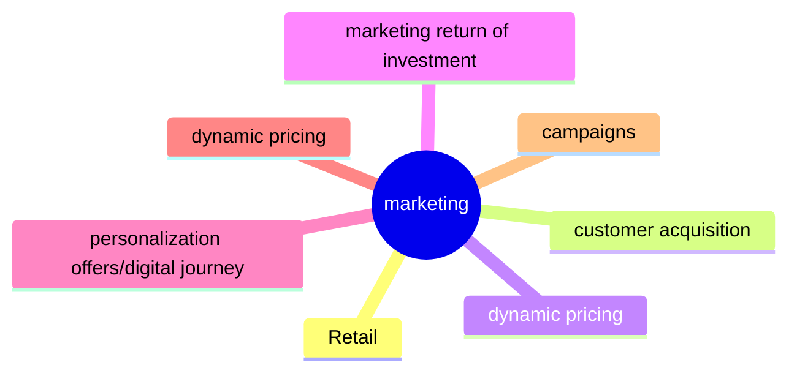
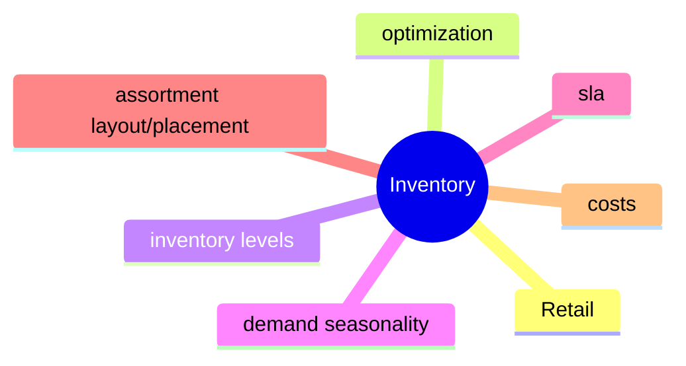
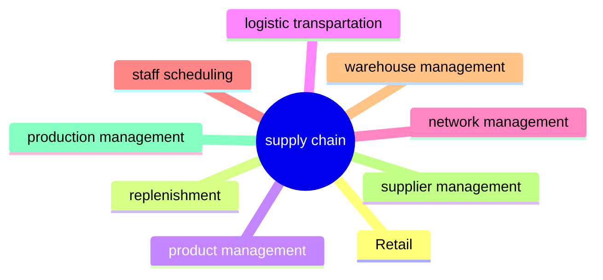
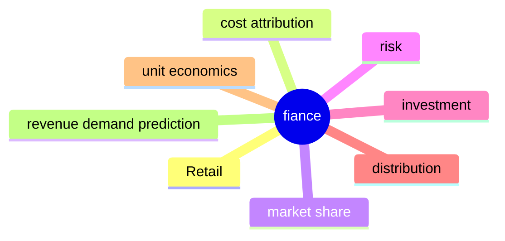

---
title: "PreClass 2.1- Insights & Impacts Transforming Industries through DS"
type: "MITClassNotes"
date: "YYYY-MM-DD"
tags: ["Python", "DataScience", "MIT", "AI", "ML","Math"]
notebook: "link goes here"
summary: "Brief summary or description of the class"
references: []
video : [link](https://olympus.mygreatlearning.com/courses/102030/pages/2-dot-4-defining-data-science?module_item_id=4759112)
---
__________________________________________________________________

# Note Content Starts Here

==Your note content goes here...==

**<span style="color: green;">List out top 3 to 5 Key learnings from this class in your own language</span>
>[!info] Summary: 

![[Pasted image 20231123101001.png]]


 **<span style="color: green;">List out anything we went over in class you disagreed with ...here ...</span>
 
>[!info] Disagreed with:

 **<span style="color: green;">List out anything we went over in class you ned more time with ...here ...</span>
>[!info] MoreTimeOn:

==Definition of Data Science:== The Inferential plus computational plus business knowledge slide.  Multiple entry points based upon your background.  
	-> Computer Science and Tech = Computational
	-> Math and Stats = Inferential
	-> Business Domain Knowledge = Business knowledge
	-> LINK to Class Image of definition ![[PreClass 2 Evolution of Data Science#^ac83f3]]


KL: The purpose of this is to understand how the CP & IP aren't enough. They only become a solution when you understand the domain in which the problem sits. 
__________________________________________________________________

##2.5 Problem Space Retail Industry
#Retail 
What constitutes a business?
-> Need a Product or Service
-> need to Produce product or service
-> need to have a market team 
-> need a finance team
-> need HR for people to run business
-> need technology


! [](https://mermaid.live/edit#pako:eNptkMFKxDAQhl8l5NSF3RfI2YsHQdxrL9NkUkeTmZJOwLrsu5taK1LMKfn48v_w36yXgNbZTBwyTD0bU0S063ydVTKW02ll63lBBUr7yznywl0EE-EyVEqBePx1JyyzMCT6BCXhHRvzXGRImM11Ao-Xn0zzyKHVlWXz9uo95UBnHDOy_gn-ty3JAkmPkfjRZEL2aCJiGMC_H4w3qYVx-2fPtqEMFNpEtxX1Vl8xY29duwaMUJP2tud7U6GqXBf21mmpeLZ1CqD4QDAWyNZFSHOjGEilPG2zf69__wJ1NYQv)

#RetailProblems 
Classic Retail Problem: [Customer Segmentation](https://en.wikipedia.org/wiki/Market_segmentation)
Classic Retail Problem: Customer Journey 
Classic Retail Problem: [Customer Experience Feedback ](https://en.wikipedia.org/wiki/Customer_experience)
Customer Lifetime Value = CLV. 
__________________________________________________________________

##2.6 Retail Marketing & Supply Chain
#RetailMarketing




What constitutes a business marketing?
-> Get more customers and more dollars at lowest cost possible
##Marketing Role
	-> Aquire customers
			-> Branding 
			-> Referel
			-> Performance Marketing (google and amazon model)
	-> Retain customers
			-> campagins in store or online
			-> marketing in digital (near real time)
	-> Grow customer

==Marketing Problem Space: How to spend dollars wisely?== 
->What is the right investment across all my marketing channels? 
 
##Inventory
#Inventory




Questions:
#Inventoryproblems
-> What are my inventory levels?
-> How do I monitor inventory? 
-> What data do I need to monitor this? 

##Supply Chain
	#SupplyChainproblems
		-> network management and the orchestration of having the right amount of stock in the right place in time. 
	-> very closely tied to Inventory




##Finance
#Financeproblems
-> understand demand
	-> forecast demand
	-> forecast revenue
	-> attribution of cost (hard problem)
	-> market share



--------------------------------------------------------------------
==Prior Class Notes==
```dataview
TABLE file.ctime as "Create Date", file.ctime as "Modified Date", tags
FROM "2.MIT"
```


