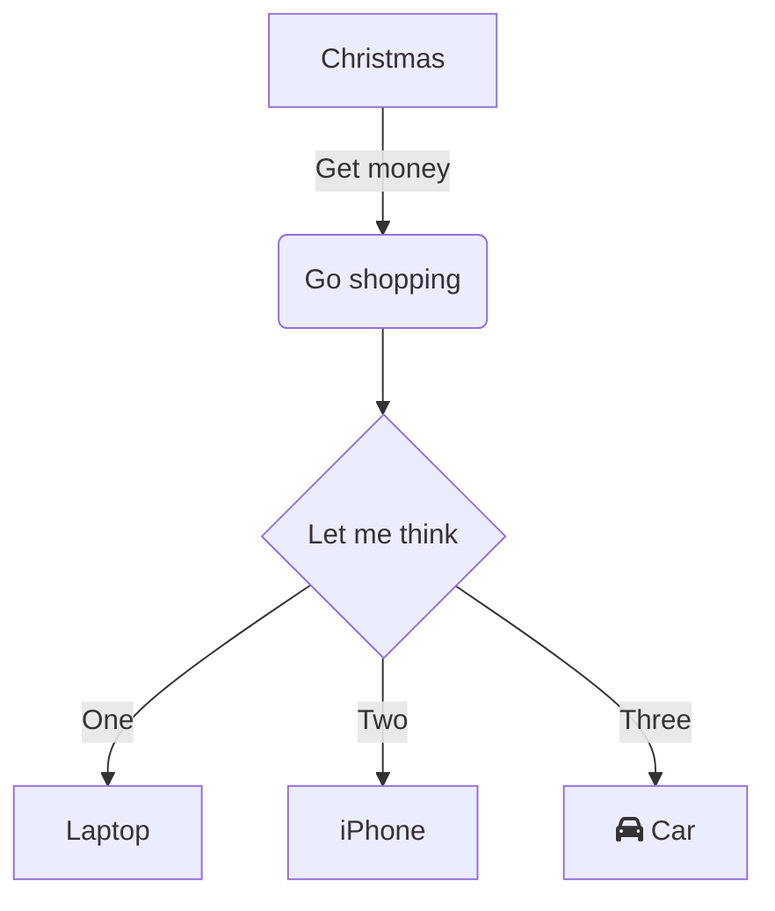

[[Obsidian Introduction]]
[[PreClass 2 Evolution of Data Science]]

>[!Info] What is Mermaid Syntax
	Mermaid.js is a **JavaScript based diagramming and charting tool that renders Markdown-inspired text definitions to create and modify diagrams dynamically.**
[
Mermaid- GIT](https://github.com/mermaid-js/mermaid)

#H1** [Mermaid Live editor ](https://mermaid.live/edit#pako:eNpVjk2Lg0AMhv9KyGkL9Q94WGh1t5fCFurN6SFo7AztfDBGpKj_fcd62c0pvM_zhkzY-JYxx-7px0ZTFKhK5SDNoS50NL1Y6m-QZZ_ziQWsd_ya4fhx8tBrH4Jx993mH1cJium8agyijXssGyre_R_HM5T1mYL4cPtLqtHP8FWbi07n_xMdObW-647yjrKGIhQU3wru0XK0ZNr0_rQmCkWzZYV5WlvuaHiKQuWWpNIg_vpyDeYSB97jEFoSLg3dI9ktXH4B_cJWqw)- You can create online and syntax is generated for you. 



```