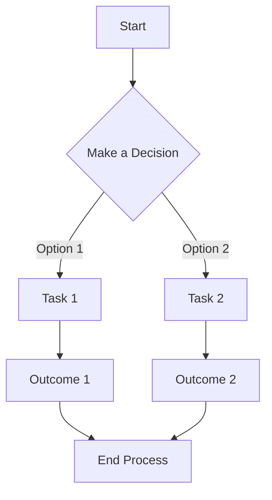

[>[!info]  Udemy Course ](https://ablink.alerts.udemy.com/ls/click?upn=gjQpuGGK4loP1Y9YreUv2VqdENO9vZSK3Qm7CdTfE6bNpCX-2Fq5dmI819np-2FYjZAg8kstetIJDbx0yTREIuxTbT2SbxpjD4HwasurNH55nSzWnr0Cz3WB0TELckf5q3KEuNGggV2Wtt6iM18hO72kCVLNjR9IKtq-2FIQ8uN3FdM5eEtWMHGVeFAnZKZ4j4igvhnWDRJcJ6HpzAh9Qc6w0ySJ0cCCm5kxwAqWwpvnH7pRC9XqpA5YXMThhVAIKcdnTJEL2QREmOE6w98hv484pl3gjNQUcxrdw5bughaSiX2NTWsXmit4cs6BXFpAA0XfuzloDo_rVVNwPqjQ2kDtBt7CMjjpN33Si6hatQ4UN2i5gIA2UAt5m9iA1bZzZLsKDEYa3W41N3-2B6LJYBNgwDJdf8WzqyzyZ33seS-2FWRfUXIi63VJ7DRPZxMI-2FEYe-2Btss7tqWnX9SYXSW8Hjy042kVCbrsnok8tS8eFPXPsI-2BwN2yZXlVB6uhkN7zDl-2Fm4mu-2BMBLAljTd02Sa-2F01alguun2cvzwk9VPOQLECpsnPP837F8N0nM13IBkEKDBII9EqBz-2BW1WDpvhhHAulvk6bqjtkGDsMiBaB9gSR-2BAAXvNYGUwWY8KpJgFT97cs9Z8lnhXSnGQRqbkSbDQd2gbSOVqgT2PlGqp3O7HERnIcM4CtpPS4WWmHkeCmWbHSDfS6pfC-2FwoeERDPfDjfUUViEY0lX-2FTS013L3F6AQBC6DBFwhPAG2ljAgqcwlN38teOru3txfP4N-2BnXrK0lcN0zWblxgX-2FCUBaN-2BFPypK4wxdrirrClC3zCDqsonZJF-2BY4k3viVuTNJLrkKC6P-2F7X-2Fwx1fBeM02wqRfhLmcxvR4wMuZ8RHxADly2WCeaGaZ1A7c9VFsYGBFO4YbYeOFpoKWSni8SubfLhavQsF-2B-2B5A5vIRiLYUmmIxy6MDEeU1GONBvYqQi-2BclbqxwXPZBOgdXg7vGxthOBMjxqxw-3D-3D)

[[Chat GPT 4]]
>[!info] To make Graphs use mermaid in chat gpt

>[!info] To make math use mathjax in chat gpt 

$$
f(x) = \sum_{n=1}^{\infty} \frac{1}{n^2} \sqrt{x^{3n} - \left( \frac{x}{2} \right)^n} + \int_{0}^{x} \sin(t^2) \, dt
$$

![[Pasted image 20231109150722.png|500x500]]

>[!Info] DataView
It's a data plug in!

>[!Info] Github with Obsidian
[
Markdown Language Guide](https://help.obsidian.md/Editing+and+formatting/Basic+formatting+syntax)

[
how to add bullets](https://www.youtube.com/watch?v=rukFr8CjzPo)

Insert DATE & TIME 

### 1. Templates

Obsidian supports templates that can include dynamic content like the current date and time.

1. **Create a Template File**: Create a new note that will act as your template. In this note, you can use variables like `{{date}}` and `{{time}}` to represent the current date and time.
    
2. **Use the Template**: When you create a new note and want to include the current date, you can insert this template. The `{{date}}` and `{{time}}` variables will be replaced with the actual current date and time.
    

### 2. Hotkeys

You can assign hotkeys to insert the current date and/or time.

1. **Go to Settings**: In Obsidian, open the Settings pane.
    
2. **Hotkeys**: Navigate to the Hotkeys section and search for commands related to inserting the current date and time.
    
3. **Assign a Hotkey**: Assign a hotkey of your choice to these commands.
    

### 3. Daily Notes Plugin

If you use the Daily Notes plugin:

1. **Enable Daily Notes Plugin**: Make sure the Daily Notes plugin is enabled in Obsidian.
    
2. **Create a Daily Note**: The plugin can automatically create a new note for each day with the date in the title or content, according to your settings.
    

### 4. Third-Party Plugins

There are also community plugins that can offer more advanced templating features, including dynamic date and time insertion.

1. **Explore Community Plugins**: In the settings, check out the Community Plugins section to find plugins that might offer enhanced templating features.

Remember to always back up your notes before experimenting with new plugins or features, as they can sometimes lead to unexpected results.